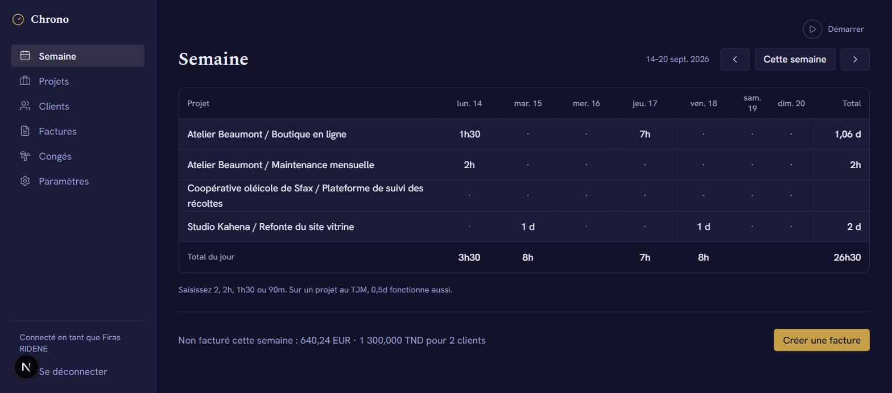
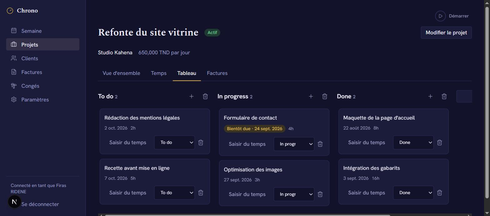
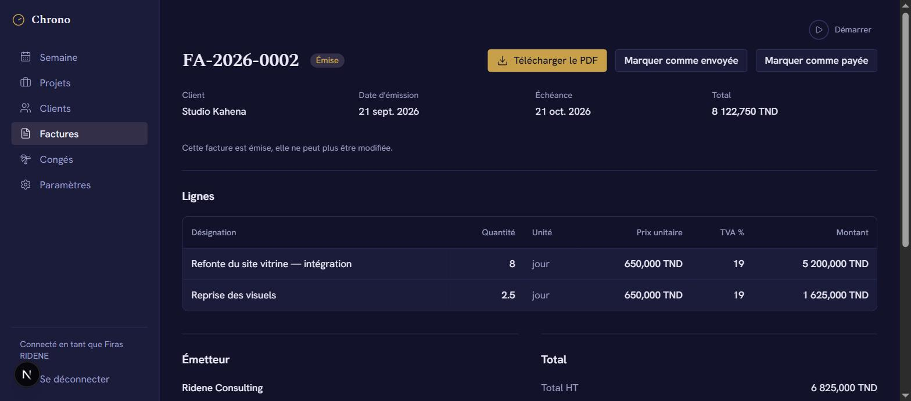
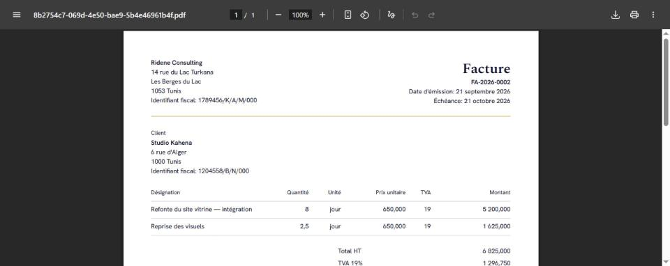
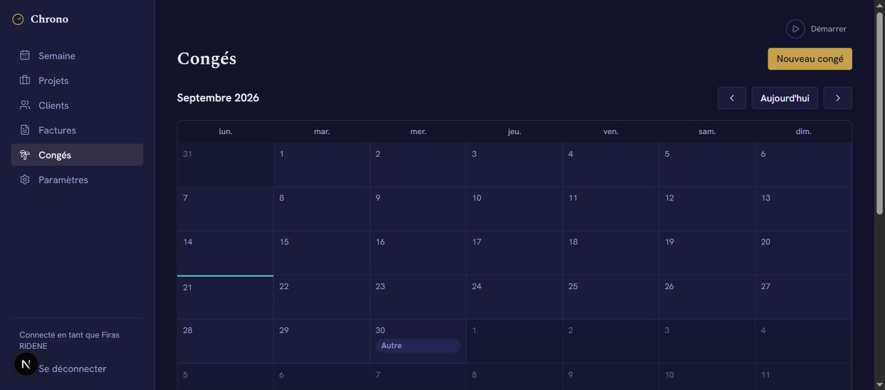
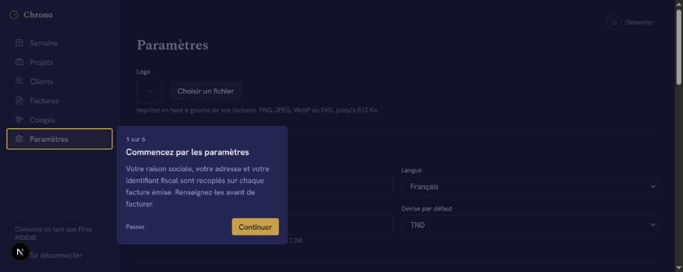

# Chrono

One place where a freelancer runs the business side of their work: clients,
projects, time, tasks, leave and invoices, all linked.



## Why this exists

A freelancer working alone usually ends up with a Google Sheet for hours, Trello
for tasks, and Word or Canva for invoices. Nothing knows about anything else, so
the same hour gets typed three times and the invoice is assembled by hand at the
end of the month, from memory.

Chrono is the version where those things are one system:

- a **task** has a "log time" button, and the entry it writes remembers the task
- **time** becomes invoice lines, and issuing the invoice locks that time so it
  cannot drift afterwards
- a **project's rate** is copied onto the invoice line when the line is made, so
  raising your rate next year does not rewrite last year's invoice
- **leave** hatches the week grid and is left out of working-day counts
- a **client's** billing details are snapshotted onto the invoice at issue time,
  so editing the client later cannot alter a document you already sent

It is built for **Tunisia and France** first: TND with three decimals alongside
EUR with two, matricule fiscal and SIRET, stamp duty and withholding tax, and the
EU reverse-charge mention when it applies. The interface is French and English.

## The rule that shapes everything

**The database is the referee, not the UI.**

Row-level security, constraints and triggers do the enforcing, so a bug in the
app cannot produce a wrong invoice or leak another user's data:

- every table has RLS with `user_id = auth.uid()`, and child rows use composite
  foreign keys so a row cannot reference another account's data even by accident
- an issued invoice is frozen by a trigger: its fields, its lines and the time
  entries behind it all refuse to change
- `issue_invoice()` is the only way to issue one. It assigns a gapless number per
  year, recomputes the totals from the lines, and snapshots both parties
- money is `numeric` in Postgres and scaled `bigint` in code, never a float

[`supabase/tests/rls_check.sql`](supabase/tests/rls_check.sql) proves it. It
creates two throwaway users, has one build a full workload, then tries every way
it can to reach that data as the other user and as a signed-out visitor.

```
46 checks, 0 failed — RLS check passed
```

## What it looks like

**Week grid.** Rows are projects, columns are days. Click a cell and type `2`,
`2h`, `1h30` or `90m`. Today gets a single teal line across the top of its
column. Underneath, unbilled time is totalled per currency.

**Board.** One kanban per project, drag and drop with a keyboard alternative on
every card. "Saisir du temps" writes a time entry against that task.



**Invoices.** Build from unbilled time or by hand, then issue. After that it is
read-only and the numbering is gapless.



**The PDF.** White paper, not the dark theme, because people print these.



**Leave.** Month calendar plus a list, feeding the week grid.



**First run.** A six step walkthrough that starts in Settings, because your legal
name and tax identifier end up on every invoice.



## Stack

Next.js 16 (App Router) · TypeScript · Tailwind v4 · Supabase (Postgres, Auth,
Storage) · dnd-kit · `@react-pdf/renderer` · `next-intl`

Tailwind's default palette and type scale are cleared in `@theme`, so a colour or
size that is not in [`DESIGN.md`](DESIGN.md) does not compile.

## Running it

### 1. Install

```bash
npm install
```

### 2. A Supabase project

Create one at [supabase.com/dashboard](https://supabase.com/dashboard). There is
no Docker-based local stack here, so this uses a hosted project.

SQL Editor → paste all of
[`supabase/migrations/0001_init.sql`](supabase/migrations/0001_init.sql) → Run.
It is not idempotent: run it once, on a fresh project. It creates 12 tables with
RLS, the triggers, `issue_invoice()`, `delete_account()`, and two private storage
buckets.

Afterwards the Table Editor should show 12 tables each with the green **RLS
enabled** badge, and Storage should show `invoices` and `logos`, both private.

### 3. Google sign-in

**Google Cloud Console** → Credentials → OAuth client ID → Web application:

| Field | Value |
|---|---|
| Authorised JavaScript origins | `https://<your-ref>.supabase.co`, `http://localhost:3000` |
| Authorised redirect URIs | `https://<your-ref>.supabase.co/auth/v1/callback` |

That redirect URI is Supabase's callback, not this app's. Getting it wrong is the
usual cause of `redirect_uri_mismatch`. The External/Internal choice now lives
under **Google Auth Platform → Audience**; while the app is in Testing, only
addresses listed there can sign in.

**Supabase dashboard** → Authentication:

- Providers → **Google**: enable, paste the client ID and secret
- Providers → **Email**: turn it off, this app is Google only
- URL Configuration → Site URL `http://localhost:3000`, and add
  `http://localhost:3000/auth/callback` to Redirect URLs

### 4. Environment

```bash
cp .env.example .env.local
```

| Variable | Where it comes from |
|---|---|
| `NEXT_PUBLIC_SUPABASE_URL` | Project Settings → API → Project URL |
| `NEXT_PUBLIC_SUPABASE_ANON_KEY` | Project Settings → API Keys → the `anon` key |
| `SUPABASE_SERVICE_ROLE_KEY` | Optional, only for `npm run seed`. Never imported by app code. |

The anon key is meant to be public: RLS is what protects the data. The service
role key is not, and must never gain a `NEXT_PUBLIC_` prefix.

### 5. Run

```bash
npm run dev
```

## Commands

```bash
npm run dev        # dev server
npm run typecheck  # tsc --noEmit
npm run lint       # eslint
npm run build      # next build
npm run verify     # checks the live Supabase project
npm run seed       # realistic data for the signed-in account
```

`npm run verify` reports whether Google is enabled, whether `anon` is refused on
all 12 tables, and whether the functions and private buckets exist. Worth running
after any dashboard change.

`npm run seed` fills the account with a Tunisian and French freelancer's history:
clients in TND and EUR, a project with a real two-month paused period, five weeks
of time, leave with public holidays, a board with tasks, and draft invoices. Add
`-- --reset` to clear first.

It seeds **drafts only**, on purpose. An invoice can only become issued through
`issue_invoice()`, which needs a signed-in user, and the triggers refuse every
shortcut, so issuing happens in the app, which exercises the numbering, the
totals and the snapshot for real.

## Deploying

The repository is connected to Vercel, so a push to `main` deploys.

Set `NEXT_PUBLIC_SUPABASE_URL` and `NEXT_PUBLIC_SUPABASE_ANON_KEY` in the Vercel
project, then add the deployed origin in two more places or sign-in will fail:

- Supabase → Authentication → URL Configuration: Site URL, and
  `https://<your-domain>/auth/callback` under Redirect URLs
- Google Cloud Console → your OAuth client → Authorised JavaScript origins

The Google redirect URI does not change: it always points at Supabase.

## Layout

```
messages/            fr.json and en.json. All UI text lives here.
src/app/             routes. (app)/ is everything behind sign-in.
src/components/      ui/ primitives, shell/ sidebar, timer, walkthrough
src/lib/             Supabase clients, money, durations, PDF, database types
supabase/migrations/ schema, applied in order, never edited after the fact
supabase/tests/      the RLS check
```

## Conventions

- Money is scaled `bigint` in code, `numeric` in Postgres, never a float
- Durations are whole minutes everywhere
- Colours, sizes and radii come only from the tokens in `globals.css`
- CSS logical properties (`ms-`/`me-`), so RTL can be added later
- Every string goes through `next-intl`, and both locale files carry every key

## Status

The MVP in [`PRD.md`](PRD.md) is built: auth, clients, projects with status
history, the week grid and timer, leave, boards, invoices with PDF and storage,
settings, GDPR export and account deletion.

Deliberately out of scope for v1: dashboards and revenue charts, quotes, expenses,
recurring projects, invoice reminders, sending email, accountant export, light
mode, Arabic and RTL, teams.
